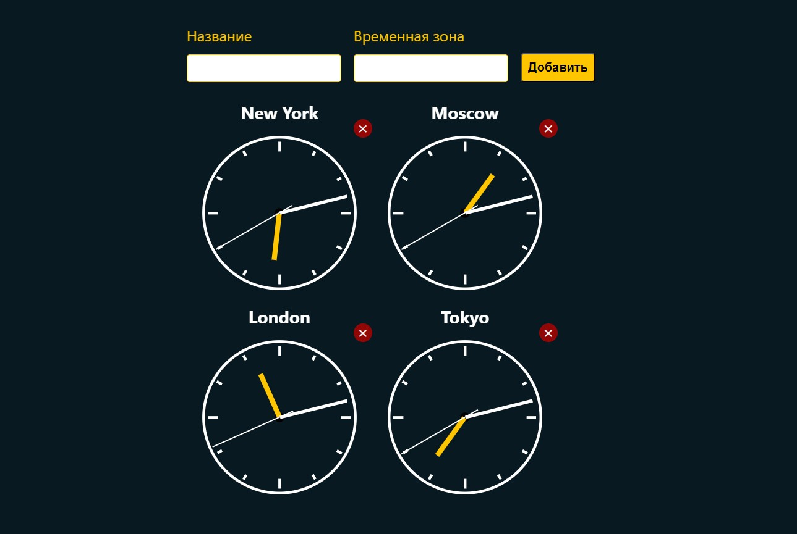

# Мировые часы

Учебный проект курса [React для JS-разработчиков](https://netology.ru/programs/react)

## **Задача**

Реализация часов, показывающих время в разных столицах мира:
* New York,
* Moscow,
* London,
* Tokyo.

## **Описание проекта**

1. Пользователь заполняет поля «Название» и «Временная зона», указывает смещение в часах относительно Гринвича и нажимает кнопку «Добавить».
2. Часы автоматически добавляются и, что самое важное, начинают тикать, то есть отсчитываются секунды, минуты и часы.
3. При нажатии на крестик рядом с часами часы автоматически удаляются, при этом все подписки — setTimeout, setInterval и другие — должны вычищаться в соответствующем методе жизненного цикла.
## **Стек технологий**

## [**Демо**](https://watches-nine.vercel.app/)
